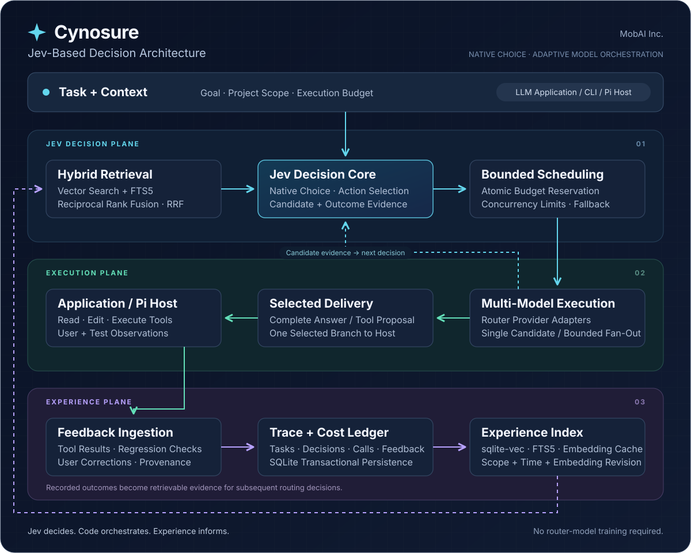

<div align="center">

# Cynosure

**以 Jev 为决策核心的自适应模型路由**

Jev-based Design · Jev 决策 · 代码编排 · 经验驱动

[English](README.md) · [简体中文](README.zh-CN.md)


[](LICENSE)

由 **MobAI Inc.** 开发

[快速开始](#快速开始) · [基准实测](#本地基准实测) · [架构](#架构与工作方式) · [文档](docs/README.md) · [贡献指南](CONTRIBUTING.md)

</div>

Cynosure 采用 **Jev-based Design**，围绕 Jev 的 [Native Choice](https://docs.typesafe.ai/primitives/choice) 构建自适应模型路由。调用哪个候选、是否追加比较、交付哪个结果，都由 Jev 在代码定义的可执行动作中判断。混合检索和真实执行反馈为 **Jev 决策循环**持续提供证据，运行时负责预算、并发和异常兜底。从空经验库即可运行，无需训练路由模型或维护人工模型质量矩阵。

## 本次评测方案：Cynosure（Fusion）

**Cynosure（Fusion）** 是下方评测使用的多模型路由方案，生成候选池由 **Grok 4.6、DeepSeek V4 Flash、GLM 5.3、GLM 5.3 Flash** 组成。单模型对照组分别单独使用这四个模型。Fusion 表示在这些模型之间路由并选择候选结果，不涉及权重融合，也没有训练第五个生成模型。

| 职责 | 本次评测使用的模型 |
| --- | --- |
| 生成候选 | `grok-4.6`、`deepseek-v4-flash`、`glm-5.3`、`glm-5.3-flash` |
| 路由决策 | `typesafe/jev-1.13`，使用 Jev Native Choice |
| 经验检索 | `jina-embeddings-v5-text-small` 与 SQLite 全文检索 |
| 兜底 | `grok-4.6`，已包含在四个候选中 |

Jev 可以先尝试一个候选，再决定追加比较或交付已有结果，每次请求不一定调用全部四个模型。接入 Pi 时，每个 Agent 轮次都可以选择模型，选中的工具提案由 Pi 执行。候选池可通过 `routes` 配置；这里的成绩对应这份固定的[评测配置](eval/runtime.json)。

## 本地基准实测

**通过率 85.4%，领先最佳单模型对照 14.6 个百分点，失败次数减半。**

采用 [Aider Polyglot](https://github.com/Aider-AI/polyglot-benchmark/tree/7e0611e77b54e2dea774cdc0aa00cf9f7ed6144f) 官方题目与未修改的测试，参考 [Aider benchmark](https://github.com/Aider-AI/aider/tree/5dc9490bb35f9729ef2c95d00a19ccd30c26339c/benchmark) 的测试—修复流程。在 24 道 Python 题、每题两次的本地对照中，Cynosure（Fusion）通过 **41/48** 次，本次最佳固定单模型 GLM 5.3 Flash 通过 **34/48** 次。同一组任务，多完成 **7 次**，通过率相对提升 **20.6%**。

| 指标 | 对照 | Cynosure（Fusion） | 改善 |
| --- | ---: | ---: | ---: |
| Python 最终通过率 | 最佳单模型 70.8% | **85.4%** | **+14.6 个百分点** |
| Python 未通过次数 | 最佳单模型 14/48 | **7/48** | **减少 50.0%** |
| Pi 四题任务耗时之和 | 首轮 1351.2 秒 | 同题重测 **733.9 秒** | **减少 45.7%** |
| Pi 四题生成调用 | 首轮 72 次 | 同题重测 **55 次** | **减少 23.6%** |

### Fusion 与其四个组成模型的对比

| 执行方案 | 最终通过 | 通过率 | 生成调用 |
| --- | ---: | ---: | ---: |
| **Cynosure（Fusion）** | **41/48** | **85.4%** | 142 |
| 单独使用 GLM 5.3 Flash | 34/48 | 70.8% | 73 |
| 单独使用 GLM 5.3 | 31/48 | 64.6% | 67 |
| 单独使用 DeepSeek V4 Flash | 31/48 | 64.6% | 71 |
| 单独使用 Grok 4.6 | 22/48 | 45.8% | 53 |

本次测得的优势是：**相比单独使用候选池中表现最好的模型，多通过 7 次任务执行**，同时使用了更多生成调用。Fusion 另有 159 次 Jev 决策和 63 次 embedding 调用。Python 执行器会测试每份完整候选代码，并在选择结果前把观察返回路由；各方案都允许对未通过的交付修复一次。这比较的是包含渠道失败在内的完整路由与执行策略，并非等预算对照或模型能力的单独比较。

**Fusion 综合成本更低吗？现有公开数据还不能证明。** Fusion 已记录费用小计为 **$1.366935**，单独使用 GLM 5.3 Flash 为 **$0.142942**；两组分别仍有 **102/364**、**7/73** 次调用未定价。小计混合了报告费用与估算费用，不是完整总成本，也不是按统一公开价重算的结果。五组费用、价格来源及缺失数据见[成本对比与重算方法](docs/benchmarks/costs.md)。

**Pi 真实缺陷修复：目标回归检查 100% 通过（8/8）。** 首轮与同题重测均为 4/4；重测保持全部通过，同时将任务耗时压缩近一半。八次运行中，七次同时完成结尾交付，重测为 4/4。

数据由 Cynosure 在本地运行 Aider Polyglot Python 子集和 Pi 四缺陷任务得到。Python 比较多模型路由与固定单模型；Pi 比较首轮与继承经验的同题重测。完整对照、调用量及方法见[基准实测](docs/validation.md)。大规模生产、未见任务泛化和长期成本收益待验证。

## 为什么选择 Cynosure

| 核心能力 | 实际作用 |
| --- | --- |
| **Jev 决策核心 · Jev Decision Core** | Native Choice 在有限可执行动作空间中驱动模型选择、候选比较与结果交付。 |
| **检索增强决策 · Retrieval-Augmented Decisions** | 将任务结果、工具观察与用户纠正作为 Jev 后续决策的证据。 |
| **混合检索 · Hybrid Retrieval + RRF** | 向量相似度与 SQLite FTS5 全文检索通过 Reciprocal Rank Fusion 融合，按项目、时间与 embedding 版本组织经验。 |
| **预算约束编排 · Budget-Constrained Orchestration** | 原子预算预留、候选有界并发与显式兜底，由代码控制调度和执行。 |
| **宿主原生工具执行 · Host-Native Tool Execution** | Pi 执行唯一选中的工具提案，实际工具结果回流后续路由决策。 |
| **经验溯源与费用账本 · Traceable Experience + Cost Ledger** | SQLite 保存任务来源、决策证据、调用用量和反馈，分别记录报告费用、估算费用与未知项。 |

一个 Node.js 运行时，一个运行时依赖，持久化本地经验。**无需训练路由模型。**

## 架构与工作方式



图中三个 Plane 对应同一运行时内的逻辑职责：

- **Jev 决策层 · Jev Decision Plane：** Jev 根据任务、候选产物与检索经验选择可执行动作，代码施加预算与并发约束。
- **执行层 · Execution Plane：** Router 适配器调用候选模型，决策循环检查产物，应用或 Pi 宿主接收选中的回答与工具提案。
- **经验层 · Experience Plane：** 实际工具结果、外部回归检查和用户纠正进入轨迹账本与检索索引，形成持久化反馈闭环。

应用负责工具执行，Jev 负责语义动作选择，运行时负责调度与费用记账。实现细节见[架构说明](docs/architecture.md)，组件与方法来源见[技术基础](docs/research/open-source.md)。

决策合同遵循 TypeSafe 的 [System One 设计](https://docs.typesafe.ai/concepts/how-to-build-with-system-one)：模型完成范围明确的结构化判断，代码掌握控制流程。[RouteLLM](https://arxiv.org/abs/2406.18665)、[Reciprocal Rank Fusion](https://doi.org/10.1145/1571941.1572114) 与 [ReAct](https://arxiv.org/abs/2210.03629) 则为围绕 Jev 核心的路由、检索和反馈机制提供参考。

## 快速开始

在源码目录使用 Node.js 24+，将 `MOB_AI_API_KEY` 配置到本机 `.env`。候选模型、Jev 和 embedding 均通过 Mob AI Router 调用。

```sh
npm ci
npm start -- run config/router.example.json config/task.example.json
npm start -- inspect coding-cold-001
npm start -- feedback coding-cold-001 config/feedback.example.json
```

示例覆盖运行任务、检查结果和追加反馈。再次运行时请使用新的任务 ID；模型目录、价格及预算参数见[配置说明](docs/configuration.md)。

### 在 Pi 中使用

```sh
npm run build
node --env-file-if-exists=.env scripts/pi.mjs /absolute/path/to/your-project
```

使用已安装的 Pi，通过 `cynosure/auto` 进行模型选择。扩展会记录实际工具结果，支持持续复用同一项目的经验。完整步骤见 [Pi 接入](docs/integrations/pi.md)。

## 文档与贡献

中英文首页保持相同的能力与实测口径，可切换至 [English README](README.md)。详细指南目前以中文提供。

- [项目介绍](docs/overview.md)：产品能力与使用场景。
- [架构说明](docs/architecture.md)：决策、执行和反馈如何连接。
- [技术基础与开源生态](docs/research/open-source.md)：采用的组件和参考机制。
- [运行说明](docs/runtime.md)：平台、存储、预算和宿主要求。
- [路线图](ROADMAP.md)：下一步的功能与验证方向。

欢迎贡献接入适配、独立任务样例、实验复现和实现改进。开发检查：

```sh
npm run check
npm run check:docs
npm run check:package
```

当前版本为 0.2.0。已完成本地基准实测、27 项核心测试及打包安装检查。

## License

[Apache-2.0](LICENSE) · Copyright 2026 **MobAI Inc.**
